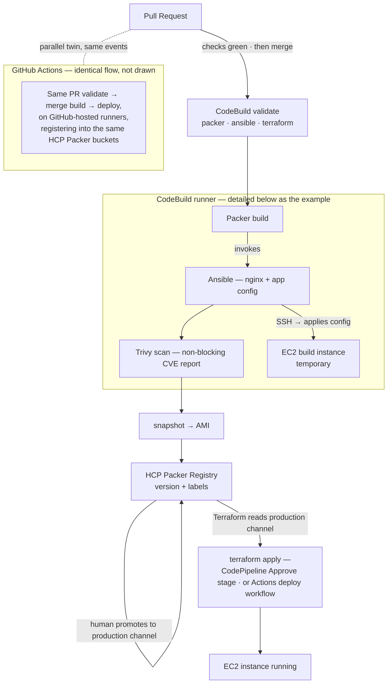

# packer-demo

End-to-end golden-image pipeline, running on **both** AWS CodeBuild/CodePipeline and
GitHub Actions. The two systems are independent and stay live at the same time, watching
the same events: a pull request kicks off **both** validators, a merge fires **both**
builders, and each side produces its own AMI and HCP Packer version of the same commit.
Builds use **Packer** (Ansible + Trivy inside the image) and register versions in **HCP
Packer**; deploy is the one choose-your-side step — approve the **CodePipeline** Approve
stage or run the Actions `deploy` workflow, both of which trigger `terraform apply` in the
same HCP Terraform workspace and converge on the same instance. No AMI IDs in code, no
static cloud keys anywhere. Source stays in GitHub; the CodeBuild projects pull from the
same repo through a CodeConnections GitHub App. The diagram below details the CodeBuild
path — the Actions flow is identical, just not drawn.



## What's in here

```
packer/
  base-os.pkr.hcl      # Amazon Linux 2023 base image -> HCP bucket "base-os" (labels: patch-level)
  webapp.pkr.hcl       # nginx app layer, parent = base-os via `production` channel -> bucket "webapp-a"
  from-scratch.pkr.hcl # Alpine 3.22 AMI built from a blank disk (amazon-ebssurrogate), no base AMI
  docker.pkr.hcl       # same webapp as a container image
  playbooks/webapp.yml # Ansible: install nginx + deploy index page
  plugins.pkr.hcl      # single source of plugin requirements
terraform/
  main.tf              # resolves the `production` channel -> launches EC2
buildspec/
  validate.yml         # PR gate: packer validate (per file), ansible syntax, terraform validate
  build.yml            # on merge to main: Packer build, publish to HCP Packer, pin + cascade
  deploy.yml           # pipeline Deploy stage: triggers the remote apply in HCP Terraform
ci/                    # CodeBuild/CodePipeline CI stack: GitHub connection, projects + webhooks, pipeline, roles
ci/README.md           # one-time setup + running both pipelines in parallel
.github/workflows/     # GitHub Actions pipelines — same flow, alternative runner
```

## Configuration — nothing environment-specific is hardcoded

Every user-specific value is a knob. Secrets go in secrets; the rest are variables.
Full setup walkthrough: [GITHUB-SETUP.md](GITHUB-SETUP.md) (step 0 is the checklist).

| Knob | Where it's read | Default |
|---|---|---|
| `HCP_ORG_ID`, `HCP_PROJECT_ID` | GitHub repo **variables** (Actions `build.yml`); CodeBuild env on `packer-demo-build` | — required, no default |
| `HCP_CLIENT_ID`, `HCP_CLIENT_SECRET` | GitHub repo **secrets** (Actions); Secrets Manager secret `packer-demo/ci` (CodeBuild) | — required |
| `AWS_ROLE_ARN` (Actions) / `TFE_TOKEN` (both) | GitHub repo **secrets** / `TFE_TOKEN` key of `packer-demo/ci` | — required |
| `AWS_REGION` | GitHub repo **variable** (Actions build) | `us-east-1` |
| `aws_region` | Packer `-var`, Terraform variable (both stacks) | `us-east-1` |
| `github_repo` | `cd ci && terraform apply -var github_repo=<owner>/<name>` | — required |
| HCP Terraform org | `cloud { organization }` in `terraform/main.tf` **and** `ci/main.tf` — edit it; Terraform forbids variables there | — edit |
| region for manual `aws`/`hcp` commands | pass `--region <region>` / `--profile <profile>` | — |

Bucket names `base-os` / `webapp-a` and project names `packer-demo-*` are conventions
of the demo, not account identifiers — safe to leave as-is.

## Demo flow (the short version)

1. Branch, edit `packer/playbooks/webapp.yml` (e.g. the index page), open a PR → `validate` goes green
2. Merge → `build` runs → new version appears in HCP Packer with labels and lineage back to `base-os`
3. Assign the version to the `production` channel (HCP Packer UI, one click)
4. Deploy — either side: approve the pipeline's **Approve** stage (`packer-demo-deploy`), or `gh workflow run deploy.yml` for the Actions twin
5. Bonus: set Trivy `--exit-code` to `1` in `webapp.pkr.hcl`, PR a vulnerable package → build goes red, image never reaches the channel

## Checking on things (CodeBuild 101)

There are **three** CodeBuild projects; the pipeline only wraps one of them. The image
builds happen in `packer-demo-build`, not in the pipeline:

| Project | What it runs | Triggered by | GH Actions twin |
|---|---|---|---|
| `packer-demo-validate` | PR gate: `packer validate`, ansible syntax, `terraform validate` (`buildspec/validate.yml`) | webhook, PR touching `packer/**`/`terraform/**` | `validate.yml` |
| `packer-demo-build` | **Builds the AMI**: `packer build` → temp EC2 → Ansible → snapshot → HCP Packer (`buildspec/build.yml`) | webhook, push to `main` touching `packer/**` | `build.yml` |
| `packer-demo-deploy` | Provisioning only: `terraform apply` in the TFC workspace (`buildspec/deploy.yml`) | pipeline Deploy stage after Approve | `deploy.yml` |

Why it looks odd: the build project fires directly off the GitHub webhook, while
the pipeline (`packer-demo-deploy`: Source → Approve → Deploy) only provisions. The
AMI build instance is throwaway — Packer creates it, configures it, snapshots it,
and terminates it, so the only long-running EC2 instance is the *deployed* demo box.

Console: **CodeBuild → Build projects → `packer-demo-build` → Build history**
https://<region>.console.aws.amazon.com/codesuite/codebuild/projects/packer-demo-build/history

CLI:

```sh
# status of the last 3 image builds
aws --profile <profile> codebuild list-builds-for-project \
  --region <region> --project-name packer-demo-build \
  --sort-order DESCENDING --max-items 3 --query 'ids' --output text

# detail of the latest build (phases, status, commit, log group)
# note: list-builds output has a trailing newline — tr -d '\n' before reusing the ID
aws --profile <profile> codebuild batch-get-builds --region <region> \
  --ids "$(aws --profile <profile> codebuild list-builds-for-project --region <region> \
    --project-name packer-demo-build --sort-order DESCENDING --max-items 1 \
    --query 'ids[0]' --output text | tr -d '\n')" \
  --query 'builds[0].[buildNumber,currentPhase,buildStatus,sourceVersion,logsGroupName]' --output text

# pipeline state (Source → Approve → Deploy)
aws --profile <profile> codepipeline get-pipeline-state --region <region> \
  --name packer-demo-deploy --query 'stageStates[].{stage:stageName,status:latestExecution.status}' --output table
```

Builds leave a full log per run in CloudWatch (`/aws/codebuild/packer-demo-*`) — open
the build in the console and click the log link, or `aws logs get-log-events` on the
`logsGroupName` above.

More ops notes (HCP API quirks, cleanup runbook, gotchas): `ci/NOTES.md`.

## Auth model

- **CodeBuild → AWS**: the build job's IAM role (`packer-demo-codebuild-build`) is
  attached to the project directly — the runner lives inside AWS, so the OIDC
  exchange GitHub Actions needed is gone. EC2 (demo scope), read on one Secrets
  Manager secret (`packer-demo/ci`), and `codebuild:StartBuild` on itself for the
  base-os → webapp cascade.
- **CI → HCP Packer**: service principal (`HCP_CLIENT_ID` / `HCP_CLIENT_SECRET`,
  keys of secret `packer-demo/ci`).
  Packer publishes versions automatically via the `hcp_packer_registry` blocks; Terraform reads
  channels with the same principal. HCP's token endpoint is `auth.idp.hashicorp.com/oauth2/token`.
- **CI → HCP Terraform**: state and runs live in workspace `<your-hcptf-org>/packer-demo`. The
  deploy job authenticates with the `TFE_TOKEN` key of secret `packer-demo/ci` and `terraform apply`
  executes as a remote TFC run — it never touches state locally. The TFC run authenticates to
  AWS with dynamic credentials (OIDC role `tfc-packer-demo`, trust scoped to the workspace's
  run phases) — no static keys anywhere. Terraform is one consumer of HCP Packer metadata;
  the same channel works from any API-capable tool.
- The CI stack itself (projects, webhooks, pipeline, roles) is Terraform in `ci/`,
  applied once — setup in `ci/README.md`.

## Why the state lives in HCP Terraform

- **CI applies need shared state.** The deploy runner is ephemeral — without remote state,
  every run would see "no resources" and create a duplicate instance, and a later
  `terraform destroy` would never know it existed.
- **One truth.** Laptop and CI share one workspace, so the next run — whoever triggers it —
  sees the same reality.
- **Locking.** Concurrent deploys queue in TFC instead of racing on a local state file.
- **Run history is the audit.** Every plan/apply records who triggered it, the diff, and the
  outcome.
- **Drift fails loudly.** Delete an AMI a channel still points at, and the next plan errors
  instead of silently drifting.

Division of labour: **HCP Packer remembers what images exist; HCP Terraform remembers what
you deployed; AWS remembers what's running.**

### Image lifecycle across the registry boundary

Registry events drive proportionate AWS actions via HCP Packer webhooks — never less, never
more:

- **Version revoked** → webhook marks the AMI *deprecated* in AWS (EC2 deprecation API).
  Running instances are unaffected, new launches wind down, and the action is reversible
  ("restore" in the registry un-deprecates). Revocation is a safe panic button, so it must
  not destroy anything.
- **Version deleted** → webhook deregisters the AMI and deletes the EBS snapshots. Permanent,
  by design — it fires only on the explicit delete event.

Without the webhook handler, registry actions are paper-only: revocation stops new
deployments, but the AMI and snapshots remain in AWS until removed manually
(`aws ec2 deregister-image --delete-snapshots`). A reference handler (API Gateway + Lambda,
from HashiCorp's Field CTO org) lives at https://github.com/danbarr/hcp-packer-webhook-aws.

## Presenting the deck

`presenterm/deck.md` is the slide deck (install: `brew install presenterm`).

```sh
make deck         # present; Ctrl+e executes the live demo blocks
make deck-notes   # terminal 1 — same, but publishes speaker notes
make notes        # terminal 2 — shows only the speaker notes, follows slide changes
```

The live blocks assume you run from a shell with `gh` authenticated and
your AWS profile logged in (only the proof and cleanup slides touch AWS).

## Local runs

```sh
cd packer && packer init . && packer validate webapp.pkr.hcl   # per-file; dir mode conflicts on purpose
packer build -var aws_region=<region> base-os.pkr.hcl   # first run only (~4 min), then assign to `production` channel
packer build webapp.pkr.hcl    # ~6 min
cd ../terraform && terraform apply    # -var aws_region=<region> if not us-east-1
```

AWS profile must point at the same account CI builds into, or the channel will
reference AMIs that don't exist locally.

## Cleanup

- **Demo instance**: destroy via the `packer-demo` TFC workspace (`terraform destroy`
  from anywhere — state is remote), or the API runbook in `ci/NOTES.md`.
- **CI stack** (projects, webhooks, pipeline, roles): `cd ci && terraform destroy`, then
  `aws secretsmanager delete-secret --region <region> --secret-id packer-demo/ci`.
- Everything else is registry metadata (HCP Packer versions, AMIs, EBS snapshots) —
  deregister/delete manually; the runbook is in `ci/NOTES.md`.
