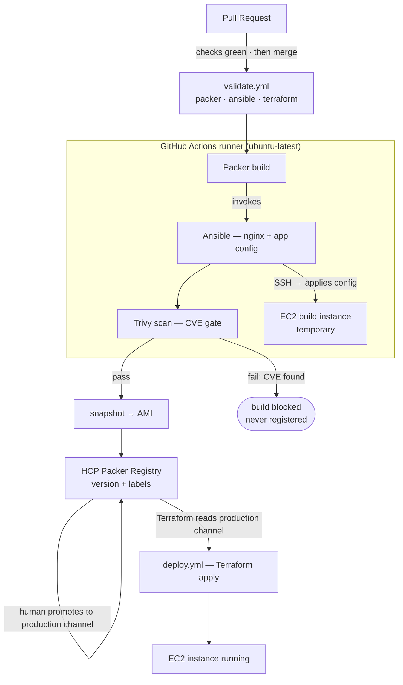

# packer-demo

End-to-end golden-image pipeline: a GitHub PR builds AMIs with **Packer**, registers
them in **HCP Packer**, and **Terraform** deploys instances pinned to a channel —
no AMI IDs in code, no static cloud keys anywhere.



## What's in here

```
packer/
  base-os.pkr.hcl      # Amazon Linux 2023 base image -> HCP bucket "base-os" (labels: patch-level)
  webapp.pkr.hcl       # nginx app layer, parent = base-os via `production` channel -> bucket "webapp-a"
  from-scratch.pkr.hcl # Alpine 3.22 AMI built from a blank disk (amazon-ebssurrogate), no base AMI
  docker.pkr.hcl       # same webapp as a container image
  playbooks/webapp.yml # Ansible: install nginx + deploy index page
  plugins.pkr.hcl      # single source of plugin requirements
terraform/
  main.tf              # resolves the `production` channel -> launches EC2
.github/workflows/
  validate.yml         # PR gate: packer validate (per file), ansible syntax, terraform validate
  build.yml            # on merge to main: OIDC -> AWS, Packer build, publish to HCP Packer
  deploy.yml           # manual dispatch, gated by the `production` GitHub environment; apply runs remotely in HCP Terraform
GITHUB-SETUP.md        # one-time setup: repo, secrets, AWS OIDC role, environments, TFC workspace
```

## Demo flow (the short version)

1. Branch, edit `packer/playbooks/webapp.yml` (e.g. the index page), open a PR → `validate` goes green
2. Merge → `build` runs → new version appears in HCP Packer with labels and lineage back to `base-os`
3. Assign the version to the `production` channel (HCP Packer UI, one click)
4. Run `deploy` → approve the `production` environment → instance runs the new image
5. Bonus: set Trivy `--exit-code` to `1`, PR a vulnerable package → build goes red, image never reaches the channel

## Auth model

- **GitHub → AWS**: OIDC. The workflow requests a JWT from `token.actions.githubusercontent.com`,
  exchanges it at STS for temporary credentials for role `packer-demo-github`. Trust policy is
  scoped to this repo (`repo:*/packer-demo@<repo-id>:ref:refs/heads/main`) — note GitHub's newer
  `sub` claim format includes actor and repo IDs.
- **CI → HCP Packer**: service principal (`HCP_CLIENT_ID` / `HCP_CLIENT_SECRET` repo secrets).
  Packer publishes versions automatically via the `hcp_packer_registry` blocks; Terraform reads
  channels with the same principal. HCP's token endpoint is `auth.idp.hashicorp.com/oauth2/token`.
- **CI → HCP Terraform**: state and runs live in workspace `lab-larry/packer-demo`. `deploy.yml`
  authenticates with the `TFE_TOKEN` secret (production environment) and `terraform apply`
  executes as a remote TFC run — it never touches state locally. The TFC run authenticates to
  AWS with dynamic credentials (OIDC role `tfc-packer-demo`, trust scoped to the workspace's
  run phases) — no static keys anywhere. Terraform is one consumer of HCP Packer metadata;
  the same channel works from any API-capable tool.

## Why the state lives in HCP Terraform

- **CI applies need shared state.** The deploy runner is ephemeral — without remote state,
  every run would see "no resources" and create a duplicate instance, and a later
  `terraform destroy` would never know it existed.
- **One truth.** Laptop and CI share one workspace, so the next run — whoever triggers it —
  sees the same reality.
- **Locking.** Concurrent deploys queue in TFC instead of racing on a local state file.
- **Run history is the audit.** Every plan/apply records who triggered it, the diff, and the
  outcome.
- **Drift fails loudly.** Delete an AMI a channel still points at, and the next plan errors
  instead of silently drifting.

Division of labour: **HCP Packer remembers what images exist; HCP Terraform remembers what
you deployed; AWS remembers what's running.**

### Image lifecycle across the registry boundary

Registry events drive proportionate AWS actions via HCP Packer webhooks — never less, never
more:

- **Version revoked** → webhook marks the AMI *deprecated* in AWS (EC2 deprecation API).
  Running instances are unaffected, new launches wind down, and the action is reversible
  ("restore" in the registry un-deprecates). Revocation is a safe panic button, so it must
  not destroy anything.
- **Version deleted** → webhook deregisters the AMI and deletes the EBS snapshots. Permanent,
  by design — it fires only on the explicit delete event.

Without the webhook handler, registry actions are paper-only: revocation stops new
deployments, but the AMI and snapshots remain in AWS until removed manually
(`aws ec2 deregister-image --delete-snapshots`). A reference handler (API Gateway + Lambda,
from HashiCorp's Field CTO org) lives at https://github.com/danbarr/hcp-packer-webhook-aws.

## Local runs

```sh
cd packer && packer init . && packer validate webapp.pkr.hcl   # per-file; dir mode conflicts on purpose
packer build base-os.pkr.hcl   # first run only (~4 min), then assign to `production` channel
packer build webapp.pkr.hcl    # ~6 min
cd ../terraform && terraform apply
```

AWS profile must point at the same account CI builds into, or the channel will
reference AMIs that don't exist locally.

## Cleanup

`terraform destroy` — everything else is registry metadata and EBS snapshots.
